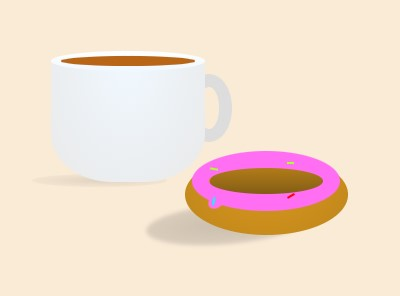

# Svelte CSS Art

AKA: A side project to practice my front-end skills.

This is a collection of art projects which I have made using pure HTML & CSS, running through Svelte for convenience.
You're more than welcome to take a look, and improve on them yourself. Let me see your improvements!

Screenshots are provided in each folder.

## To Run:
Simply move the file into the main /src/ folder of your Svelte project, and import it into your `main.js` file for compilation.

## Most Recent Work: **Coffee**
